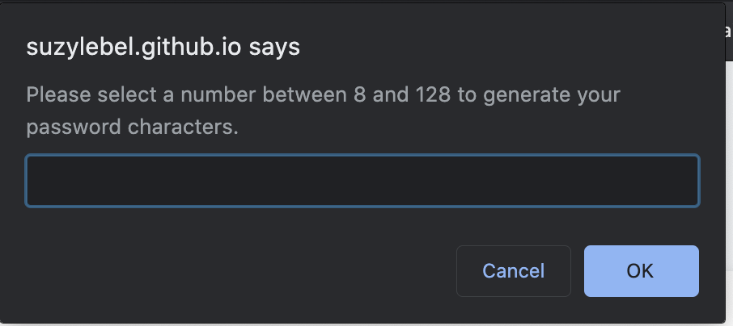
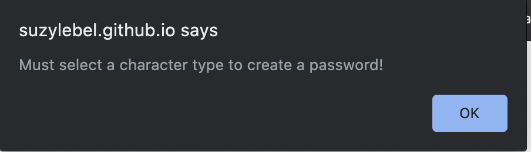
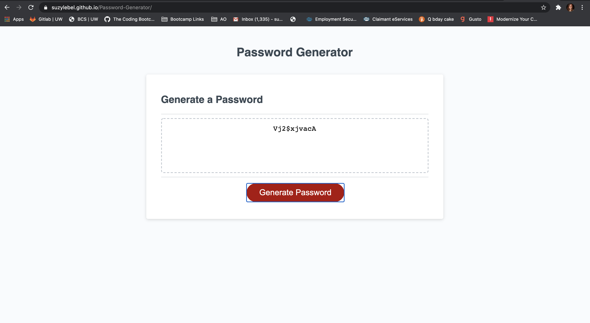

HOMEWORK ASSIGNMENT 3: Password Generator

Explore the [Deployed Password Generator](https://suzylebel.github.io/Password-Generator/)

View the [Github page](https://github.com/suzylebel/Password-Generator)

## Table of Contents
1. [User story]{#User-story)
2. About the Project
3. Tech/Framework used
4. Code Breakdown
5. UI // Things to update
6. License
7. Contact
8. Credits


 ## User story 

```
AS AN employee with access to sensitive data
I WANT to randomly generate a password that meets certain criteria
SO THAT I can create a strong password that provides greater security
```


## About the Project

The goal of this project was to create a password generator with the selected length prompted to the user, and to randomly distrubute characters, letters and numbers based on what the users request was. My first vision was more complicated than it needed to be. Using javascript, I created 2 functions: The (generatePassword) and anothe function that held Math.floor(Math.Random). My approach to this was to avoid the "dry principle: do not repeat yourself in coding." I found myself repeating lots of code and was able to condense it to less than 80 lines of javascript code. 


## Tech Used
The index.html and style.css were provided to start.
I created my two functions in javascript and they were linked to my index.html page. 

## Code Breakdown

After the user clicks on the red generate password button they are prompted with a series of questions to answer so my code can create them a password. 

The user has to:
1. select a # between 8 and 128 
2. Select at least one:
  a. speical chracter
  b. upper case letter
  c. lower case letter
  d. number 
  
If these are met then a random password will be generated and returned to the user on the screen.  
  
 While statements: 
 I created 2 while statements that alert the user if what they have selected or typed in is not a valid statement. 
 If they select a number less than 8 or over 128 (or invalid things such as letters) it will alert them to "try again" and select a number so a password can be generated. 

 
 ```while (passwordLength < 8 || passwordLength > 128 || isNaN(passwordLength)){ 
    passwordLength = prompt("Please select a number between 8 and 128 to generate your password characters.");
  }
  ```

 
 The while statement for the lowercase, uppercase, numbers and special characters is crucial because if they select 'cancel for all 4 my code has no way to generate a password. It will restate the confirm questions to the user so a password can be generated. 
 

    while (lowerCase === false && upperCase === false && numbers === false && specialCharacters === false) {
    alert("Must select a character type to create a password!")
    var upperCase = confirm("Do you want uppercase letters? (click OK for yes, or cancel for no)");
    var lowerCase = confirm("Do you want lowercase letters? (click OK for yes, or cancel for no)");
    var numbers = confirm("Do you want numbers? (click OK for yes, or cancel for no)");
    var specialCharacters = confirm("Do you want special characters? (click OK for yes, or cancel for no)");
    
If the user doesn't select one of these as true it will alert this:    
    


I created 4 string arrays for my variables in my upcoming if statements: 
```
 var numberArray = [0, 1, 2, 3, 4, 5, 6, 7, 8, 9];
  var letterLower = ["a", "b", "c", "d", "e", "f", "g", "h", "i", "j", "k", "l", "m", "n", "o", "p", "q", "r", "s", "t", "u", "v", "w", "x", "y", "z"];
  var letterUpper = ["A", "B", "C", "D", "E", "F", "G", "H", "I", "J", "K", "L", "M", "N", "O", "P", "Q", "R", "S", "T", "U", "V", "W", "X", "Y", "Z"];
  var symbols = ["!", "#", "$", "%", "&", "'", "(", ")", ",", "*", "+", ",", "-", ".", "/", ":", ";", "<", "=", ">", "?", "@", "[", "]", "^", "_", "`", "{", "|", "~"];
```
Then creating my "if" statements is where the bulk of this code happens: 

```
  if (upperCase) {
    userSelection = userSelection.concat(letterUpper);
    password += getRandomchar(letterUpper);
  }
  ```
  This statement explains that if they have selected that they want uppercase letters in the password I will get 1 random character that is upper case. 
  
  This repeats for all of the other 3 conditions if they are deemed true. 
  
  Which ever is true runs through a for loop and this is where what ever length the user has requested their password to be happens. 
  
  ``` for (var i = password.length; i < passwordLength; i++) {
      password += getRandomchar(userSelection); 
 ```
      
  
  This is the end of the function. 
  
  it still needs to run through one more function the infamous: Math.floor(Math.random) which will randomiza all of my variables that were selected to be true!
  
  ``` function getRandomchar(charArray) {
    var randomIndex = Math.floor(Math.random() * charArray.length);
    return (charArray[randomIndex]);
  ```
  I decided to pull my math.random function outside of the first function so I am not repeating myself and am only randomizing what is selected! I could of put it inside my if statements but this would of been "dry" coding. 
  
  
```
 var generateBtn = document.querySelector("#generate");

  // Write password to the #password input
  function writePassword() {
    var password = generatePassword();
    var passwordText = document.querySelector("#password");

    passwordText.value = password;
  }

  // Add event listener to generate button
  generateBtn.addEventListener("click", writePassword);
```
This code was provided for us, but returns the password into the text box so the user can see what their password is!
The addEventListener is looking for the "click" on generate password on the index.html page. 


Here is a generated password for a user that selected "10" as the lenght of their password and to include: numbers, upper, lower, and special characters: 



Here is a generated password for a user that selected "100" to be the length of their password and to include only uppercase letters and numbers: 

``` 
I0E8WQF3V4FG9JERJMNS6R30QXLZHOEJHLNV48ZLDL5DOVXMPA3RCT3GINCRQ7CU9YB0KOFUOG84NP3VA2TG7RP84W1QHT7I165Q
```

## UI
I would like to be able to store the passwords generated and give the user an easier return option to restart their password conditions. 

I would also create a "copy to clipboard" event listener since the user is likely to use these password somewhere else. A long length password would be hard to remember or type so copy and paste function would beneift the user. 

## Contribute
If you’d like to fork this project from github please feel free! With a pull request I can grant you access to leave comments and notes about this project. 

## License 
None
 
## Contact 

Suzy Le Bel 
suzy.lebel@gmail.com

Project Link can be found [here.](https://suzylebel.github.io/Password-Generator/)

## Credit
Assistance from Amanda Crawford (BCS Tutor). 


